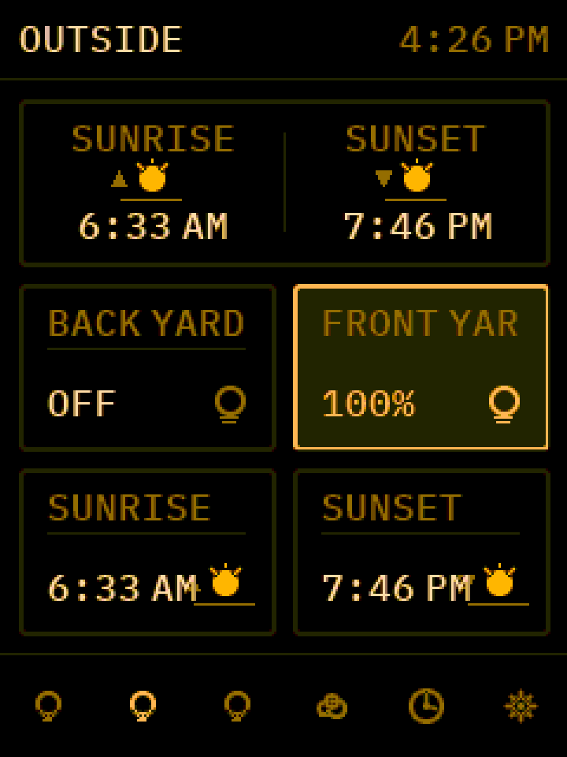
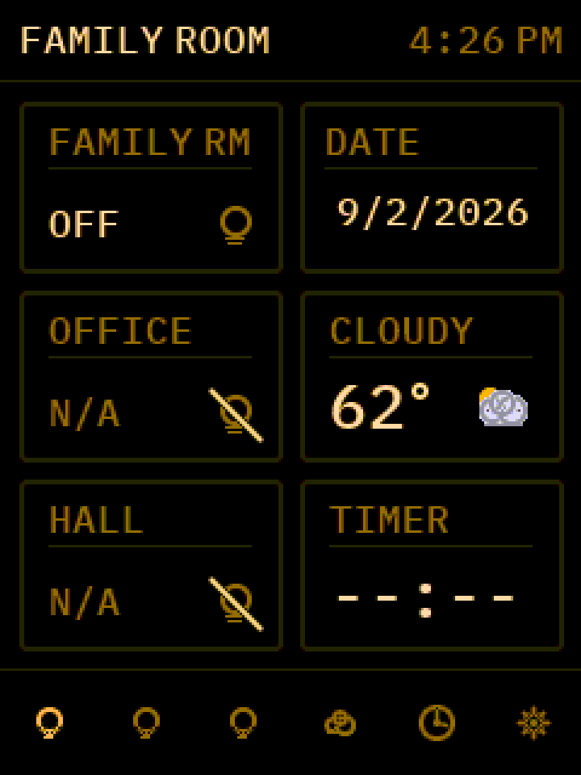
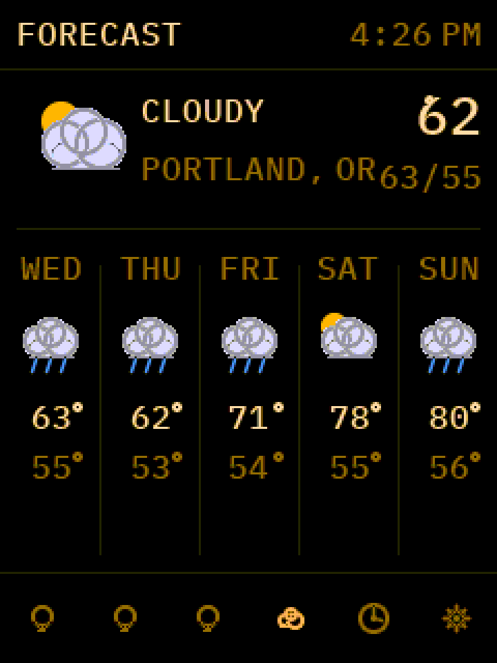
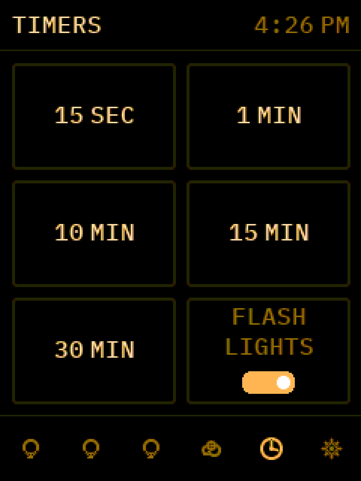
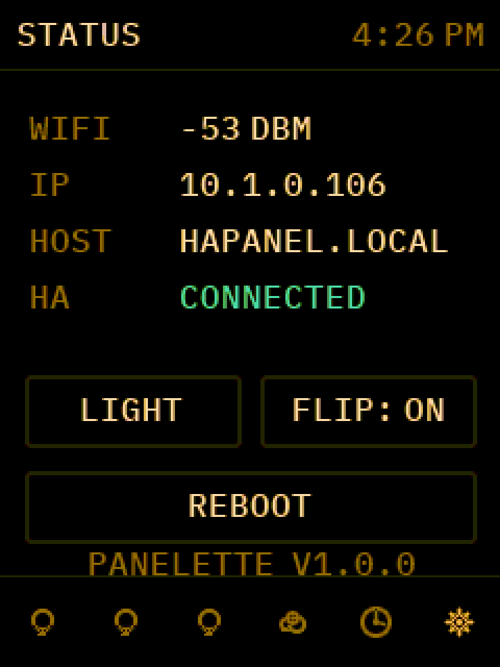

# Panelette - Installation Guide

**Panelette** is a multi-page Home Assistant touch control panel for the
**ESP32-2432S028R** ("CYD" - Cheap Yellow Display), a ~$15 2.8" 240x320
touchscreen board.

Tap to toggle lights and switches, press-and-hold a light for a brightness
slider, swipe between pages, see a live weather forecast, and run
kitchen-style timers that can flash your lights when they finish.



---

## Two ways to install

### Easiest - browser installer (no IDE)
Open **https://fatofthelan.github.io/panelette/** in **Chrome, Edge, or
Opera on a computer**, pick your **display panel** (leave it on the default
if unsure), plug the board into USB, and click **Install**. It flashes the
firmware and then asks for your Wi-Fi. That's it - skip the rest of this
guide and jump to [Step 8](#step-8---connect-the-panel-to-home-assistant) to
connect Home Assistant.

If the screen comes up white, garbled, or with wrong colours, the board has
a different display than the default - reconnect, pick another panel option,
and install again.

On a phone, or using Safari/Firefox? Flash from a desktop but **skip** the
Wi-Fi prompt - the panel comes up as its own `PaneletteXXXX` Wi-Fi network
with a setup page you open from your phone.

### Build from source
The rest of this guide. Use this if you want to change the code, or if the
browser installer won't work for you. You get the same firmware.

---

## What you need (build from source)

### Hardware
- A 2.8" **resistive-touch "CYD"** (`ESP32-2432S028R`). That label covers
  several different display panels, so there's a build (and browser-installer
  option) per panel. **Verified boards:**

  | Board | Panel | Build env / installer option |
  | --- | --- | --- |
  | [ELEGOO 2-pack, USB-C](https://amzn.to/4dhlNyx) &mdash; **recommended** | ILI9341 | `cyd_ili9341` (the default) |
  | [This ST7789 board](https://amzn.to/4h9kKCf) | ST7789 (colour-inverted) | `esp32dev` |

  *Amazon affiliate links.* Other ST7789 CYDs use `cyd_st7789`. If you already
  own a CYD, flash the default first; if the screen is white or the colours
  are wrong, try another option.
- A **USB data cable** that fits the board (USB-C or micro-USB depending on
  the model). Many cheap cables are charge-only and will not work - if the
  board doesn't show up as a serial port, try another cable first.
  - **On USB-C boards, use a USB-A-to-USB-C cable, not USB-C-to-USB-C.** Many
    CYDs omit the CC pull-down resistors a C-to-C cable relies on, so the
    board gets no power (screen stays dark, no serial port). A plain USB-A
    port always supplies 5 V, so an A-to-C cable works. Known CYD quirk.
- A computer (Windows, macOS, or Linux) for the one-time flashing step.

A fresh unit names itself `PaneletteXXXX` (the last 4 hex digits of its MAC),
so two on one network won't clash. You can rename it in the web UI.

### Software (installed once, on your computer)
- **Visual Studio Code** - https://code.visualstudio.com
- The **PlatformIO IDE** extension for VS Code (installed from inside VS Code,
  steps below)
- **USB serial driver** - only some setups need this:
  - Most CYDs use a **CH340** USB chip; some USB-C boards use a **CP2102**.
  - **Linux:** usually works out of the box.
  - **macOS / Windows:** if the board doesn't appear as a serial port after
    plugging it in, install the CH340 driver from
    https://www.wch-ic.com/downloads/CH341SER_ZIP.html (Windows) or
    https://github.com/WCHSoftGroup/ch34xser_macos (macOS), then reboot.
    For a CP2102 board use Silicon Labs' CP210x driver instead.

### Home Assistant
- A running Home Assistant instance on the **same network** as the panel.
- Its address, e.g. `http://homeassistant.local:8123` or `http://192.168.1.50:8123`.
- Ability to create a **Long-Lived Access Token** (any admin user can - steps below).

### Network
- **2.4 GHz Wi-Fi.** The ESP32 cannot connect to 5 GHz networks. If your
  router uses one name for both bands, the panel will find the 2.4 GHz one
  automatically; if the bands have separate names, use the 2.4 GHz one.
- WPA2 is recommended. WPA3-only networks may not connect.
- The panel uses **DHCP** by default. A static IP can be set later in the web
  UI (Network section) - if a static IP fails to connect, the panel falls
  back to DHCP so you can still reach it to fix the values.

---

## Step 1 - Get the code

**If you have `git`:**
```
git clone https://github.com/fatofthelan/panelette.git
cd panelette
```

**If you don't:** on the project's GitHub page, click **Code -> Download ZIP**,
then unzip it somewhere permanent (not your Downloads folder).

---

## Step 2 - Install VS Code + PlatformIO

1. Install and open **Visual Studio Code**.
2. Open the **Extensions** panel (the square icon in the left sidebar, or
   `Ctrl+Shift+X` / `Cmd+Shift+X`).
3. Search for **PlatformIO IDE**, click **Install**. Wait for it to finish
   (it downloads a toolchain in the background - this can take a few minutes
   the first time). Reload VS Code if it asks.
4. **File -> Open Folder** and choose the `panelette` folder from Step 1.
   PlatformIO will detect the project and do more first-time setup - give it
   a minute until the bottom status bar stops showing activity.

---

## Step 3 - Enter your Wi-Fi credentials

**This step is optional.** If you skip it, the panel boots into setup mode
(its own `PaneletteXXXX` Wi-Fi network with a setup page) and you enter your
network there - see Step 6. Baking Wi-Fi into the firmware just saves that
one step.

1. In VS Code's file explorer, open the **`include`** folder.
2. Find **`secrets.h.example`**. Right-click it -> **Copy**, then right-click
   the `include` folder -> **Paste**. Rename the copy to exactly
   **`secrets.h`**.
3. Open `secrets.h` and replace the placeholders:
   ```c
   #define WIFI_SSID     "your-wifi-ssid"
   #define WIFI_PASSWORD "your-wifi-password"
   ```
   Keep the quotes. Save the file.

`secrets.h` is git-ignored, so your password will not be committed if you
later push changes. Compiled-in credentials take priority over anything set
on the device; edit `secrets.h` and re-flash to change them.

---

## Step 4 - (Optional) set the default HA address

The panel names itself `PaneletteXXXX` automatically and you can rename it (and
set the HA URL) from the web UI after first boot, so this step is optional.

To pre-set the Home Assistant address, open **`src/main.ino`** and edit:
```c
const char* HA_URL_DEFAULT = "http://homeassistant.local:8123";
```
Leave the `:8123` port unless you've changed it. Save the file.

---

## Step 5 - Flash the panel

1. Plug the CYD into your computer with the USB **data** cable.
2. **Pick the build for your panel.** The default is `cyd_ili9341` (the
   recommended ELEGOO board). For a different panel, open the PlatformIO
   sidebar (the alien-head icon) -> **Project Tasks**, expand the env you
   want (`cyd_st7789` or `esp32dev`), and use its **Upload** there instead of
   the status-bar button - or change `default_envs` at the top of
   `platformio.ini`. That file's header has a screen-symptom guide.
3. Flash it: at the bottom of the VS Code window, in the blue PlatformIO
   status bar, click the **-> (right arrow)** icon - "PlatformIO: Upload"
   (this uses the default env). First build downloads libraries and takes a
   few minutes; later ones are ~10 seconds.
4. Watch the terminal at the bottom. Success ends with:
   ```
   Writing at 0x... (100 %)
   Hash of data verified.
   [SUCCESS]
   ```
5. The panel reboots on its own and shows the **Home** screen with a clock
   (or the **Wi-Fi setup** screen if you skipped Step 3). If it's white or
   the colours look wrong, flash a different env (step 2).

If upload fails, see **Troubleshooting** below.

---

## Step 6 - Get the panel on your network

**If you baked Wi-Fi in at Step 3**, it's already connected - skip to
finding it below.

**If you skipped Step 3**, the panel shows a **Wi-Fi setup** screen:

1. On a phone or laptop, join the Wi-Fi network named **`PaneletteXXXX`**
   (open, no password).
2. A setup page opens automatically (or browse to `http://192.168.4.1`).
3. Pick your network, enter the password, **Save & connect**. The panel
   restarts and joins your network.

You can also re-run this later: **Network** card in the web UI ->
**Forget Wi-Fi & restart**.

### Find it

- On the panel, swipe left/right to the **Status** page. It shows:
  - **WiFi:** Connected / Disconnected
  - **IP:** e.g. `192.168.1.73`
  - **Host:** the panel's name, e.g. `PaneletteA1B2.local`
- On your computer/phone browser (same network), open `http://<that host>`
  (e.g. `http://PaneletteA1B2.local`)
  - If your device or router doesn't resolve `.local` names, use the IP from
    the Status page instead: `http://192.168.1.73`

You should see the **Panelette Settings** page.

---

## Step 7 - Create a Home Assistant access token

1. In Home Assistant, click your **username** (bottom-left) to open your
   profile.
2. Open the **Security** tab (older HA: scroll to the bottom of the profile
   page).
3. Under **Long-Lived Access Tokens**, click **Create Token**.
4. Name it something like `Panelette` and click OK.
5. **Copy the token now** - HA shows it only once. It's a long string of
   letters and numbers.

---

## Step 8 - Connect the panel to Home Assistant

On the panel's web page, in the **Home Assistant** section:

1. **Home Assistant URL** - the panel tries to auto-fill this by finding
   Home Assistant on your network. If it's blank or wrong, enter it
   manually, e.g. `http://homeassistant.local:8123` or
   `http://192.168.1.50:8123` (no trailing slash).
2. **Long-lived access token** - paste the token from Step 7.
3. Set the **Area / room name** shown on the Home screen. (Time zone and
   location are pulled from Home Assistant automatically on save - adjust
   them here afterward if needed.)
4. Click **Save Home Assistant**. A banner reports whether the panel
   reached Home Assistant. You can re-check any time with the **Test**
   button, or by tapping the **HA** row on the panel's Status page.

> Use a plain `http://` address on your local network. `https://` with a
> self-signed certificate will not work; a valid public certificate does.

**Live updates (optional).** In the same section there's a **Live updates**
switch. Left off, tiles refresh by polling Home Assistant every ~30 seconds.
Turned on, the panel holds a WebSocket to Home Assistant and tiles change
almost instantly. It needs a plain `http://` URL and falls back to polling
if anything goes wrong; the status line under the switch shows what it's
doing.

---

## Step 9 - Add your controls

On the panel's web page:

1. Click **Manage tiles** on a page (the **Home** page exists by default), or
   **Add area page** for a new room.
2. **Add tile:**
   - **Type:**
     - *Light* - tap toggles; press and hold for a large brightness slider
     - *Switch* - tap toggles
     - *Sensor* - read-only value
     - *Scene / Script / Button* - tap runs it once
     - *Weather* - current icon + temperature (no entity needed)
     - *Timer* - jumps to the Timers page (no entity needed)
     - *Sunrise / Sunset / Sunrise + Sunset* - today's times for your
       location (no entity needed; use a wide tile for the combined one)
     - *Date / Date + weekday* - the current date; the wide "+ weekday"
       version shows the day name large with the date beneath. A per-tile
       switch picks `M/D/YYYY` (default) or `D/M/YYYY`.
   A light/switch/sensor tile shows **N/A** with a line through its icon
   when Home Assistant reports that entity as unavailable.
   - **Label** - what shows on the tile
   - **Entity ID** - start typing and pick from the list (the panel loads
     your entities of that type from Home Assistant), or paste an ID. If the
     list is empty, check the HA connection - you can still type the ID.
   - **Size** - `1x1` or `1x2` (wide, spans both columns)
3. **Add from a Home Assistant area** (below Add tile): pick an area, load its
   lights or switches, and tick what you want. If you use group helpers
   (e.g. an "Office" group of 3 bulbs), the group is listed first and its
   members are pre-unchecked - so you add one tile, not three.
4. Each page holds up to **6 tiles** (2 columns x 3 rows; a wide tile uses
   two cells). **Drag the handle (⠿)** to reorder tiles, or delete them.
   On the main settings page you can drag **pages** into any order the same
   way (Home stays first). The default order is Home, your rooms, Forecast,
   Timers, Status - a "Reset to default order" button restores it.

To find entity IDs by hand: Home Assistant **Developer Tools -> States**
(e.g. `light.living_room_lamp`, `switch.coffee_maker`, `scene.movie_night`).

Changes take effect on the panel immediately.

---

## Using the panel

| Home / room | Forecast | Timers | Status |
|:-:|:-:|:-:|:-:|
|  |  |  |  |

- **Swipe left/right** - change pages, or tap an icon in the bottom bar. The
  highlighted icon is the page you're on.
- **Tap a light/switch tile** - toggle it.
- **Press and hold a light tile** - a large brightness slider fills the
  screen; drag up/down, lift off to set it.
- **Forecast page** - 5-day weather from Open-Meteo (no account needed;
  location follows your time zone, or set it manually in the web UI).
- **Timers page** - tap a preset (editable in the web UI) or set a custom
  time. The **Flash Lights** toggle (on by default, and remembered) pulses
  your configured lights when a timer finishes; a red screen border also
  flashes until you dismiss it (both are configurable in the web UI's
  Timers section).
- **Status page** - connection info, a **Dark/Light** toggle, a
  **Flip screen 180°** toggle, and **Reboot** (tap twice to confirm).
- **Theme** - in the web UI's Device section, pick a colour scheme, a
  typeface (Sans or Mono), and rounded or square corners. Dark/Light stays
  on the Status page.

---

## Updating the firmware later

1. Get the new code (`git pull`, or download the new ZIP over your folder -
   but **keep your `include/secrets.h`**).
2. Plug in over USB, click **Upload** again.

Your pages, tiles and HA token are stored on the panel's flash filesystem and
**survive a firmware update** - they are not part of the code.

### Backup / move your setup
On the web page's **Backup & Restore** section, use **Back up** to download
a `panelette-<name>-<date>.json` file. Flip it to **Restore** to upload that
file back (on this panel, or another one you want to clone the setup to) -
the panel reboots afterward.

---

## Troubleshooting

**The board doesn't show up / upload fails with "could not open port" or
"no serial data received"**
- Use a different USB cable (charge-only cables are the #1 cause).
- **USB-C board + a USB-C-to-USB-C cable?** Switch to a **USB-A-to-USB-C**
  cable. Many CYDs omit the CC pull-down resistors a C-to-C cable needs, so
  the board never powers on. Known CYD quirk.
- Install the CH340 driver (see "What you need"); a CP2102 board needs the
  Silicon Labs CP210x driver instead.
- Close anything else using the serial port (Arduino IDE, a serial monitor).
- Some boards need you to **hold the BOOT button** while upload starts, then
  release it once "Connecting..." appears.
- Try a slower speed: open `platformio.ini` and change `upload_speed` to
  `230400`.

**Upload succeeds but the screen is white, black, or garbled**
- "ESP32-2432S028R" ships with several different display panels. The browser
  installer defaults to ILI9341 (the recommended ELEGOO board); if yours is
  different, pick another panel option there, or build from source with a
  matching env:
  - `~/.platformio/penv/bin/pio run -e cyd_ili9341 -t upload` &mdash; ELEGOO
    boards and other ILI9341 panels (this is the default)
  - `~/.platformio/penv/bin/pio run -e cyd_st7789 -t upload` &mdash; "normal"
    ST7789 panels (no colour-inversion quirk)
  - `~/.platformio/penv/bin/pio run -e esp32dev -t upload` &mdash; ST7789
    boards whose colours come out inverted on `cyd_st7789`
- Symptom guide (also in `platformio.ini`'s header):
  - **white, no image** &rarr; wrong driver, try another env
  - **white with negative-image (dark-on-light) text** &rarr; right driver,
    wrong inversion &mdash; switch between `cyd_st7789` and `esp32dev`
  - **blues look orange / colours swapped** &rarr; edit that env's
    `TFT_RGB_ORDER` between `TFT_BGR` and `TFT_RGB`
  - **small offset or a thin black band at an edge** &rarr; add
    `-D TFT_ROW_OFFSET=` / `-D TFT_COL_OFFSET=` to that env
- Touch calibration (`TOUCH_*_MIN/MAX` in `src/main.ino`) is per-panel as well
  &mdash; expect to redo it on a different board (see "Touch is offset" below).

**Panel shows "No WiFi connection"**
- Re-check `include/secrets.h` (exact SSID and password, keep the quotes),
  save, re-upload.
- Confirm it's a **2.4 GHz** network.
- Check the router isn't blocking new devices (MAC filtering).

**Web page won't load at the `.local` name**
- Use the IP address from the panel's Status page instead.
- Make sure your computer/phone is on the same network/VLAN as the panel.

**Tiles show but nothing happens when tapped / sensors show "?"**
- Re-check the **HA URL** (no trailing slash, correct port) and that the
  **token** was pasted fully.
- Confirm the **entity ID** exactly matches Developer Tools -> States.
- The token's user must have permission to control that entity.

**Touch is offset or unresponsive**
- The touch calibration constants near the top of `src/main.ino`
  (`TOUCH_X_MIN` ... `TOUCH_Y_MAX`) are tuned for a typical CYD. If yours is
  noticeably off, those values can be adjusted; open an issue with what you're
  seeing.

**Watch the panel's debug output**
- In VS Code's PlatformIO status bar, click the **plug icon** ("Serial
  Monitor"). It runs at 115200 baud and prints Wi-Fi status, the assigned IP,
  and any errors.

---

## Privacy / network notes

- The panel talks only to your Home Assistant instance and to
  `api.open-meteo.com` for weather. It has no cloud account and phones home
  nowhere else.
- The HA token is stored in plain text on the panel's flash and sent over
  your local network - keep the panel on a trusted network, and revoke the
  token in HA if a panel is lost.
