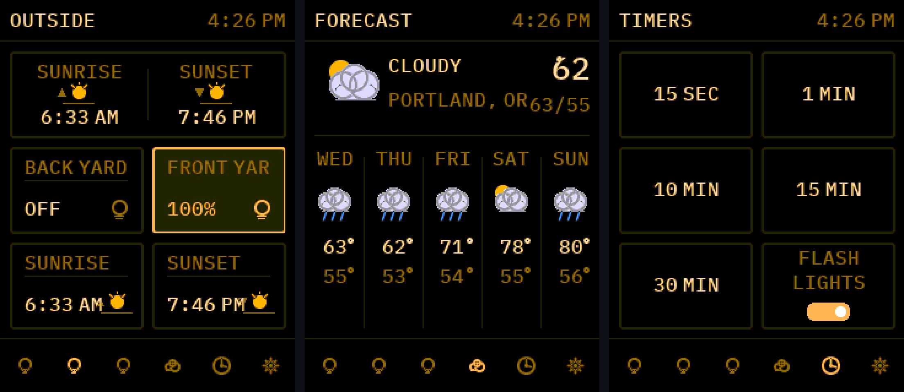

# Panelette

A multi-page Home Assistant touch control panel for the **ESP32-2432S028R**
("CYD" — Cheap Yellow Display), a ~$15 2.8" 240×320 resistive-touch board.

Tap tiles to toggle lights and switches, press-and-hold a light for a
brightness slider, swipe between pages, check a weather forecast, and run
kitchen timers that can flash your lights when they finish. Everything is
configured from a built-in web UI — no YAML, no HA add-on.



> Built from scratch on TFT_eSPI + XPT2046_Touchscreen. Not based on any
> third-party sketch. Previously called "HA Panel".

## Features

- **Tiles**: light (tap = toggle, hold = large brightness slider), switch,
  sensor, scene / script / button, weather, timer, sunrise / sunset,
  date / weekday. Unavailable entities show **N/A** with a struck-through icon.
- **Pages**: up to 8, 2×3 tile grid each (wide 1×2 tiles supported), swipe
  or footer-icon navigation, per-page hide, drag-to-reorder.
- **Forecast page**: 5-day weather from Open-Meteo (no API key).
- **Timers page**: presets + custom time, optional light-flash and a
  flashing screen border on expiry.
- **Themes**: colour scheme (cool / warm / phosphor / neutral) × typeface
  (anti-aliased Noto Sans / IBM Plex Mono) × corners (rounded / square),
  plus a dark/light toggle. All anti-aliased.
- **Web UI**: device + theme settings, HA URL/token, add/remove/reorder
  pages and tiles, entity picker and "add from an HA area", static-IP or
  DHCP, backup / restore, reboot.
- **Home Assistant**: plain `http://` REST, with **optional WebSocket live
  updates** (`subscribe_entities`) for near-instant tile changes instead of
  30-second polling. mDNS auto-discovery of the HA URL on boot.

## Install

### Browser (no IDE)

Open **[fatofthelan.github.io/panelette](https://fatofthelan.github.io/panelette/)**
in Chrome / Edge / Opera on a desktop, plug the board into USB, click
**Install**. It flashes the firmware and asks for your Wi-Fi (via
[Improv](https://www.improv-wifi.com/), or a captive portal from the
phone). No `secrets.h`, no compiler.

### Build from source

```
git clone https://github.com/fatofthelan/panelette.git
cd panelette
# optional: cp include/secrets.h.example include/secrets.h  (bake in Wi-Fi)
# open in VS Code with the PlatformIO extension, then Upload
```

Full step-by-step, including the Home Assistant token, in
[INSTRUCTIONS.md](INSTRUCTIONS.md). Config (pages, tiles, HA token, theme)
lives on the device's flash and survives firmware updates.

## Hardware

Any 2.8" **resistive**-touch "CYD" (`ESP32-2432S028R`). That label ships with
several different display panels, so the installer / build has a matching
option per panel. **Verified boards:**

| Board | Panel | Build / installer option |
| --- | --- | --- |
| [ELEGOO 2-pack, USB-C](https://amzn.to/4dhlNyx) — *recommended* | ILI9341 | `cyd_ili9341` (installer default) |
| [This ST7789 board](https://amzn.to/4h9kKCf) | ST7789 (inverts colours) | `esp32dev` |

*Amazon affiliate links.* Other ST7789 CYDs use the `cyd_st7789` option. Plus a
USB **data** cable (many cheap cables are charge-only).

If the screen is white or the colours are wrong after flashing, it's the wrong
panel option — pick another and reflash (config is kept). See
[CLAUDE.md](CLAUDE.md) for the hardware details — it doubles as the contributor
technical reference.

## License

Code: **MIT** — see [LICENSE](LICENSE).
Bundled font subsets: **SIL OFL 1.1** — see [FONTS.md](FONTS.md).
